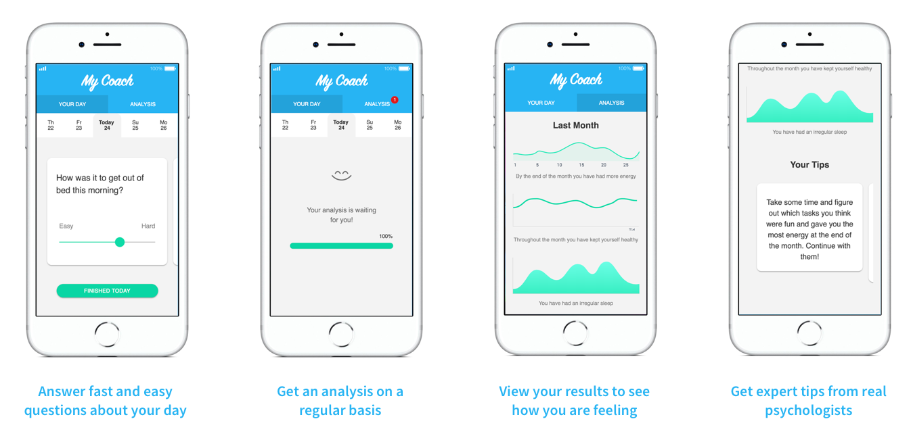
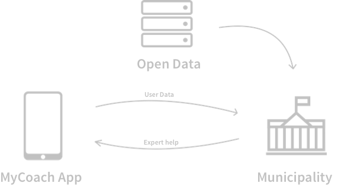

This project was bootstrapped with [Create React App](https://github.com/facebookincubator/create-react-app).

### Setup
Clone into a repository on your machine
```
npm install
npm start
```

Created during [Good Tech Hack 2018](https://goodtechhack.confetti.events/) in Sundsvall, Sweden.
The theme of the hackathon was sustainability and optimization.


# MyCoach
Sick leaves and stress related problems are getting more and more usual.
A 59% increase in reported cases were found in Sweden during a 4 year period.

MyCoach is a full solution for the municipality to get to know their inhabitants better, and therefore being able to make better decisions, and increase public health.

## Application
It is an application for individuals to track their health and daily overall
feeling. When a user has tracked themselves for a few days, expert help will be sent to the user with tailored tips on what the person can do to feel better. The user data is fully anonymous.



## Statistical Tool
In return, the municipality will get user data of their inhabitants which they
can analyze with the MyCoach statistical tool, together with open data that is available such as air quality, water quality, or noise levels in the city.

This creates opportunities for the municipality to see where and what they can improve in the city, based on how the people are feeling.

In the short run, the inhabitants will get expert help through the app, and in
the long run, they will also get a better city where the municipality can create better opportunities for living a good life.



## Machine Learning
In order to get the expert help sent to the users, machine learning will be used to find patterns in the user data, which means that your data that you provide will also help others in the city. A good incentive for people to use the app.

The expert help would be done by hiring one or two psychologists that can help label certain patterns and create a supervised learning problem approach.

This is also a lot more cost effective than trying to help a large mass of people with multiple psychologists.
